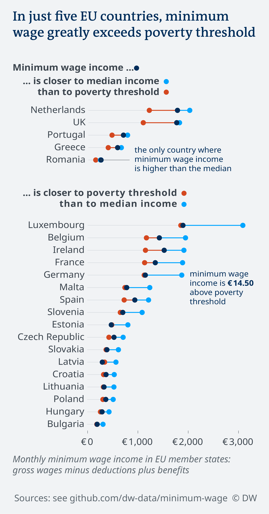
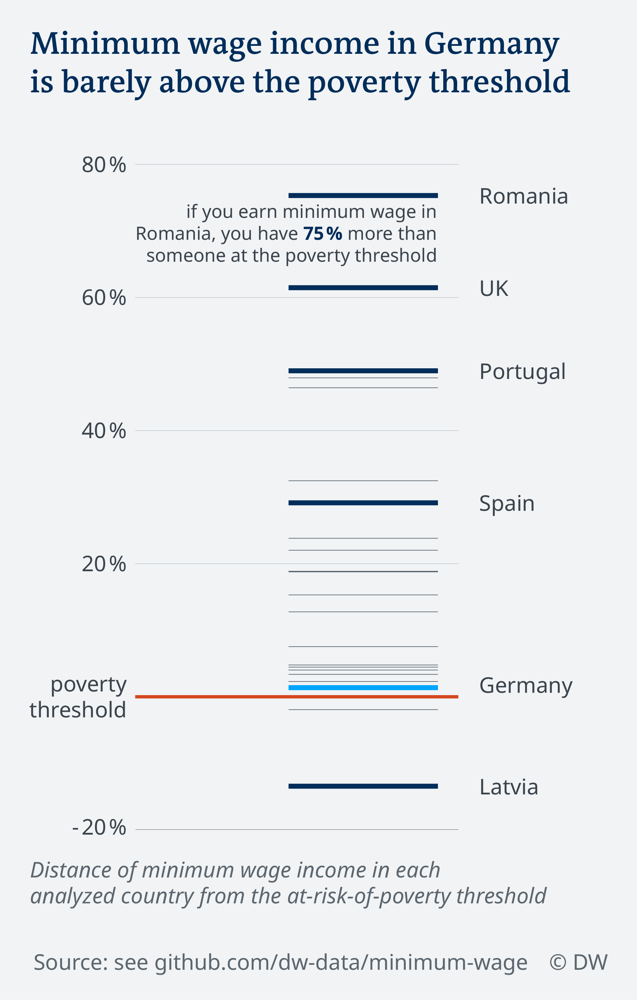

# Minimum wages throughout Europe
## How well do minimum wages keep workers out of poverty?
*Idea and initial research:* [Olaya Argüeso](https://twitter.com/oargueso)
*Research, data analysis, visualization and writing:*

[Kira Schacht](https://twitter.com/daten_drang)

Germany is raising its minimum wage again: From January 2019, employers have to pay their employees at least €9.19 per hour. In a comparison of gross minimum wages, that puts Germany among the top countries in Europe. But is it really?

This story explores what life on minimum wage means beyond the gross numbers. One way of doing this is examining how well minimum wage policies do in keeping people out of poverty. The basic assumption of the story is: If a single person works full time on minimum wage, they should, at the very least, be above the poverty threshold.

So, DW calculated the disposable income that a single full-time minimum wage worker can rely on each month for 22 EU countries and compared it with
-   The median disposable income in each country
-   The poverty threshold in each country

The following text will explain the process behind this story: Which data sources were used, how the analysis was conducted and how the data was visualized.

Source data
===========

An overview of the data used for the analysis.

OECD: Real minimum wages
------------------------

Link: <https://stats.oecd.org/Index.aspx?DataSetCode=RMW>
Annual minimum wages in 2017 constant prices at 2017 USD exchange rates.
Source Data extracted on 27 Nov 2018 12:58 UTC (GMT) from OECD.Stat

OECD: Benefits, Taxes and Wages – Net Incomes
---------------------------------------------

General link: <https://stats.oecd.org/Index.aspx?DataSetCode=FIXINCLSA>
Query link: <https://stats.oecd.org//Index.aspx?QueryId=86237>

Benefits, taxes and wages
-   in 2017
-   in national currency
-   for an unmarried, employed single person with no children
-   by country and income component
-   for incomes in the range of 20 to 80 percent of the average worker

More info on the methodology of the tax-benefit-model [here](http://www.oecd.org/els/soc/Methodology_2013.pdf).
Source Data extracted on 27 Nov 2018 13:35 UTC (GMT) from OECD.Stat

Exchange rates
--------------

Link: <https://data.oecd.org/conversion/exchange-rates.htm>
Yearly average exchange rates of national currency units to US Dollar

Poverty threshold
-----------------

Link: [*ilc\_li01*](http://appsso.eurostat.ec.europa.eu/nui/show.do?query=BOOKMARK_DS-053418_QID_-60D87CB0_UID_-3F171EB0&layout=HHTYP,L,X,0;GEO,L,Y,0;INDIC_IL,L,Z,0;CURRENCY,L,Z,1;TIME,C,Z,2;INDICATORS,C,Z,3;&zSelection=DS-053418INDICATORS,OBS_FLAG;DS-053418TIME,2017;DS-053418CURRENCY,EUR;DS-053418INDIC_IL,LI_C_MD60;&rankName1=INDIC-IL_1_2_-1_2&rankName2=CURRENCY_1_2_-1_2&rankName3=INDICATORS_1_2_-1_2&rankName4=TIME_1_0_1_0&rankName5=HHTYP_1_2_0_0&rankName6=GEO_1_2_0_1&rStp=&cStp=&rDCh=&cDCh=&rDM=true&cDM=true&footnes=false&empty=false&wai=false&time_mode=NONE&time_most_recent=false&lang=EN&cfo=%23%23%23%2C%23%23%23.%23%23%23)
At risk of poverty threshold (60% of median equivalised disposable income) for a single person in Euros, 2017
More info on EU poverty statistics [here](https://ec.europa.eu/eurostat/statistics-explained/index.php/People_at_risk_of_poverty_or_social_exclusion#Income_poverty).
Source Data extracted on 06 November 2018

Median equivalised net income
-----------------------------

Link: [*ilc\_di04*](http://appsso.eurostat.ec.europa.eu/nui/show.do?query=BOOKMARK_DS-053408_QID_633C0FD4_UID_-3F171EB0&layout=HHTYP,L,X,0;GEO,L,Y,0;INDIC_IL,L,Z,0;UNIT,L,Z,1;TIME,C,Z,2;INDICATORS,C,Z,3;&zSelection=DS-053408INDIC_IL,MED_E;DS-053408TIME,2017;DS-053408INDICATORS,OBS_FLAG;DS-053408UNIT,EUR;&rankName1=INDIC-IL_1_2_-1_2&rankName2=UNIT_1_2_-1_2&rankName3=INDICATORS_1_2_-1_2&rankName4=TIME_1_0_1_0&rankName5=HHTYP_1_2_0_0&rankName6=GEO_1_2_0_1&rStp=&cStp=&rDCh=&cDCh=&rDM=true&cDM=true&footnes=false&empty=false&wai=false&time_mode=NONE&time_most_recent=false&lang=EN&cfo=%23%23%23%2C%23%23%23.%23%23%23)
Median yearly equivalised disposable income in Euro, 2017, over all households
Source Data extracted on 26 November 2018

Analysis
========

Collecting the minimum wages
----------------------------

The source for the minimum wages was the dataset “Real minimum wages” from the Organisation for Economic Cooperation and Development (OECD). The latest available data was from 2017. Still, this data was used rather than the corresponding Eurostat dataset ([earn\_mw\_cur](http://appsso.eurostat.ec.europa.eu/nui/show.do?dataset=earn_mw_cur)), which provides numbers for 2018, because
1.  the OECD provides annual wages, which is what the poverty thresholds and the median income use as well.
2.  the latest available data on poverty thresholds and median income was from 2017 as well.

For Bulgaria, Croatia, Malta and Romania, OECD did not provide minimum wage data. For these 4 countries, minimum wages from the Eurostat dataset for the second half of 2017 (2017S2) were used and multiplied by 12 to get annual figures. Guidelines for converting monthly figures to annual ones are taken from the “Data Sources” section of the Eurostat article “[Minimum wage statistics](https://ec.europa.eu/eurostat/statistics-explained/index.php/Minimum_wage_statistics)”.

The minimum wages are given in US Dollar in the OECD dataset, so they were converted to Euros using the OECD-provided yearly average exchange rate of 0.887 Dollars to 1 Euro.

Estimating the disposable net income at minimum wage
----------------------------------------------------

Poverty thresholds and similar EU statistics on poverty and inequality are all based on the so-called [equivalised disposable income](https://ec.europa.eu/eurostat/statistics-explained/index.php/Glossary:Equivalised_disposable_income). In simple terms, this is the gross income of an adult, including any benefits they receive, minus their taxes and social contributions.

But the minimum wages in the EU are all given as gross wages. So, the first task was estimating the monthly net income that minimum wage workers can rely on, in order to then compare these values with the poverty thresholds of each country.

The OECD publishes data from their so-called “Tax-Benefit-Models”. Based on a few parameters – household type, marriage status, number of children and employment status, this model provides net earnings based on gross wages in each OECD country.
They calculate net earnings as follows:
```
Gross Income
- (Income Tax + Social Contributions)
+ (Housing Benefits + Family Benefits +
   Unemployment Benefits + Social Assistance + In-work benefits)
```
This story explores the case of a person working **full-time** on minimum wage with no other gross earnings
-   in a **single household**
-   with no **children**
-   who is **employed**
-   and **unmarried**

This constitutes one of the more favorable situations a minimum wage worker can be in. In fact, many of them do not work full time, and some have children or other household members to support. The article specifically analyzes this most conservative case – after all, if even people in this situation are at risk of poverty, many people will be even worse off.
The OECD provides income composition data for a range of different gross wage levels. They are given in percent of the average worker, in 1-percent-intervals (see linked dataset above).

For example, the data would show that a person making 47% of the average worker in France would have €17,883.00 a year in gross income and end up with €15,731.00 as their yearly net earning, after deductions and benefits.
Relevant data was extracted as follows:

1.  **Download the income compositions** for each country for the most recent year (2016) based on above assumptions from the OECD dataset for an income range of 20% to 80% of the average worker, in 1-percent-intervals
2.  **Convert values** from national currencies to Euros using the OECD yearly average exchange rate for 2016
3.  For each minimum wage, **look up the closest *higher* gross earning** in the tax database. We chose the closest higher one in order to make a conservative estimate: When in doubt, we estimate the net incomes to be higher than reality instead of lower.
4.  For each gross value, **extract the corresponding net earning** from the tax database.
5.  For each gross value, **extract the specific income compositions**: Income Tax, Social Contributions, Housing Benefits, Family Benefits, Unemployment Benefits, Social Assistance, In-work benefits.

The net earnings constituted the basis for the main analysis, but the income composition was used as background info for the reporting. This helped highlight, for example, the high amount of government benefits that full-time minimum wage workers in the UK and the Netherlands are eligible for.

Poverty thresholds and median net incomes
-----------------------------------------

After calculating the estimated net full-time minimum wage income for a single person, it was possible to determine how it relates to the median income of each country and the poverty thresholds.
The median income of a country is the middle income, meaning half of the country’s population earn more and half earn less than that value.
The median income also determines the poverty threshold in each country. The threshold most often used is defined as 60 percent of the median income, which is what was used in this analysis as well.

Eurostat provides figures on median income and poverty thresholds for a single person as a yearly equivalised disposable income (see above). Since this is comparable to the minimum wage income calculated in the step before, those figures could be used as they were.

Distance from poverty and median
--------------------------------

As a final step, the distance between the minimum wage income and the poverty threshold was calculated. Apart from the absolute difference in Euros, the relative difference in percent was calculated as well: (minimum wage / poverty threshold) – 1.

Additionally, the relative difference of the minimum wage income from the poverty threshold if the benefits were removed was analyzed, to see how the bare minimum wage, without additional support payments, relates to the poverty threshold.

Final Dataset Overview
======================

**Column Name**|**unit**|**explanation**|**source**
-----|-----|-----|-----
Code|text|3 digit country code| 
Country|text|Name of the country| 
minwage 2017|Euro|Gross annual minimum wage in 2017|OECD
estimated net from minwage|Euro|Minimum wage income: Gross wage minus deductions plus benefits. calculation see section “Analysis”.|OECD
poverty threshold yearly|Euro|At risk of poverty threshold (60 percent of median equivalised disposable income) for a single person|Eurostat ([*ilc\_li01*](http://appsso.eurostat.ec.europa.eu/nui/show.do?query=BOOKMARK_DS-053418_QID_-60D87CB0_UID_-3F171EB0&layout=HHTYP,L,X,0;GEO,L,Y,0;INDIC_IL,L,Z,0;CURRENCY,L,Z,1;TIME,C,Z,2;INDICATORS,C,Z,3;&zSelection=DS-053418INDICATORS,OBS_FLAG;DS-053418TIME,2017;DS-053418CURRENCY,EUR;DS-053418INDIC_IL,LI_C_MD60;&rankName1=INDIC-IL_1_2_-1_2&rankName2=CURRENCY_1_2_-1_2&rankName3=INDICATORS_1_2_-1_2&rankName4=TIME_1_0_1_0&rankName5=HHTYP_1_2_0_0&rankName6=GEO_1_2_0_1&rStp=&cStp=&rDCh=&cDCh=&rDM=true&cDM=true&footnes=false&empty=false&wai=false&time_mode=NONE&time_most_recent=false&lang=EN&cfo=%23%23%23%2C%23%23%23.%23%23%23))
median net income yearly|Euro|Median yearly equivalised disposable income|Eurostat ([*ilc\_di04*](http://appsso.eurostat.ec.europa.eu/nui/show.do?query=BOOKMARK_DS-053408_QID_633C0FD4_UID_-3F171EB0&layout=HHTYP,L,X,0;GEO,L,Y,0;INDIC_IL,L,Z,0;UNIT,L,Z,1;TIME,C,Z,2;INDICATORS,C,Z,3;&zSelection=DS-053408INDIC_IL,MED_E;DS-053408TIME,2017;DS-053408INDICATORS,OBS_FLAG;DS-053408UNIT,EUR;&rankName1=INDIC-IL_1_2_-1_2&rankName2=UNIT_1_2_-1_2&rankName3=INDICATORS_1_2_-1_2&rankName4=TIME_1_0_1_0&rankName5=HHTYP_1_2_0_0&rankName6=GEO_1_2_0_1&rStp=&cStp=&rDCh=&cDCh=&rDM=true&cDM=true&footnes=false&empty=false&wai=false&time_mode=NONE&time_most_recent=false&lang=EN&cfo=%23%23%23%2C%23%23%23.%23%23%23))
minwage 2017 monthly|Euro|Yearly value divided by 12|OECD
est. net from minwage monthly|Euro|Yearly value divided by 12|OECD
poverty threshold monthly|Euro|Yearly value divided by 12|Eurostat
median net income monthly|Euro|Yearly value divided by 12|Eurostat
dist poverty net|Number 0-1|Percent distance of net minimum wage from poverty threshold  (minwage / poverty threshold) - 1| 
dist poverty net w/o benefits|Number 0-1|Percent distance of net minimum wage from poverty threshold without benefits| 
diff poverty net|Euro|Absolute distance of net minimum wage from poverty threshold| 

Visualization
=============

The graphics seen below were created using R (see script `minwage.R`) and Adobe Illustrator.




